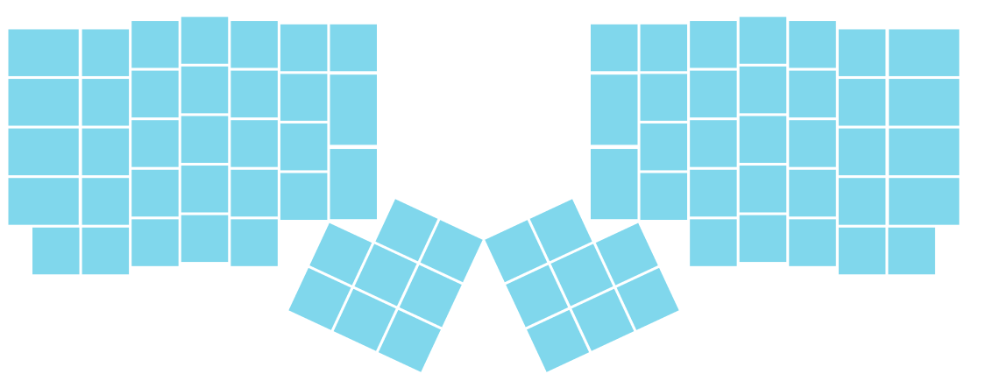

# quarkQuark keymap for the 80-key variant of the ergodox

To use this keymap, it must be copied or symlinked to the correct location.
It is stored here in XDG_CONFIG_HOME for convenience.
``` sh
ln -s ~/.config/qmk/my-keymap <qmk home>/keyboards/ergodox_ez/keymaps/quarkQuark
```
By default, `qmk setup` sets the qmk home as `~/qmk-firmware`.
To choose a different location, run `qmk setup -H <filepath>` instead.


